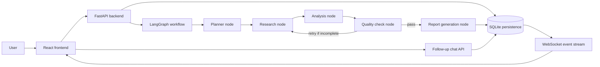

# ZyLabs AI Research Copilot

A production-minded full-stack AI research copilot for preparing sellers and business teams for account meetings.

The app lets a user create a research session with a company, website, and objective. A FastAPI backend runs a multi-node LangGraph workflow, persists intermediate outputs in MongoDB, streams live session updates over WebSocket, returns a structured briefing report, and supports follow-up chat grounded in the generated report. Authentication is handled by Clerk.

## Architecture Flow



## Features

- Clerk authentication — login, signup, and per-user session isolation
- Research session creation
- Session history and detail views
- LangGraph workflow with multiple meaningful nodes
- Shared graph state and conditional routing
- Intermediate progress persisted and streamed to the UI over WebSocket
- Structured report with all required sections
- Follow-up chat grounded in report context with a dedicated scrollable chat panel
- MongoDB persistence
- Loading and error states
- Responsive React UI

## Local Setup

### Backend

```bash
cd backend
python3 -m venv .venv
source .venv/bin/activate
pip install -r requirements.txt
uvicorn app.main:app --reload
```

The backend runs on `http://localhost:8000`.

Required `.env`:

```bash
GEMINI_API_KEY=your_key_here
GEMINI_MODEL=gemini-3.5-flash
DATABASE_URL=mongodb+srv://<user>:<password>@cluster.mongodb.net/research_copilot
CLERK_DOMAIN=your-clerk-domain.clerk.accounts.dev
```

For full AI synthesis, set a Gemini key. A deterministic fallback helper exists in the workflow code, but the current no-key synthesis path should be wired and verified before promising offline report generation.

### Frontend

```bash
cd frontend
npm install
npm run dev
```

The frontend runs on `http://localhost:5173`.

Required frontend env:

```bash
VITE_API_URL=http://localhost:8000
VITE_CLERK_PUBLISHABLE_KEY=pk_test_your_clerk_publishable_key
```

## API Overview

All endpoints except `/health` require a `Authorization: Bearer <clerk_jwt>` header.

- `GET /health`
- `POST /sessions`
- `GET /sessions`
- `GET /sessions/{session_id}`
- `WS  /sessions/{session_id}/ws` — WebSocket stream for live progress and report updates
- `POST /sessions/{session_id}/run`
- `POST /sessions/{session_id}/chat`

## Implementation Notes

This  uses website homepage fetching plus Gemini-backed synthesis. The graph and API are provider-ready: wiring deterministic no-key synthesis, adding live search, enrichment providers, or strengthening the LLM prompt can happen inside the `research` and `analysis` nodes without changing the frontend contract.
