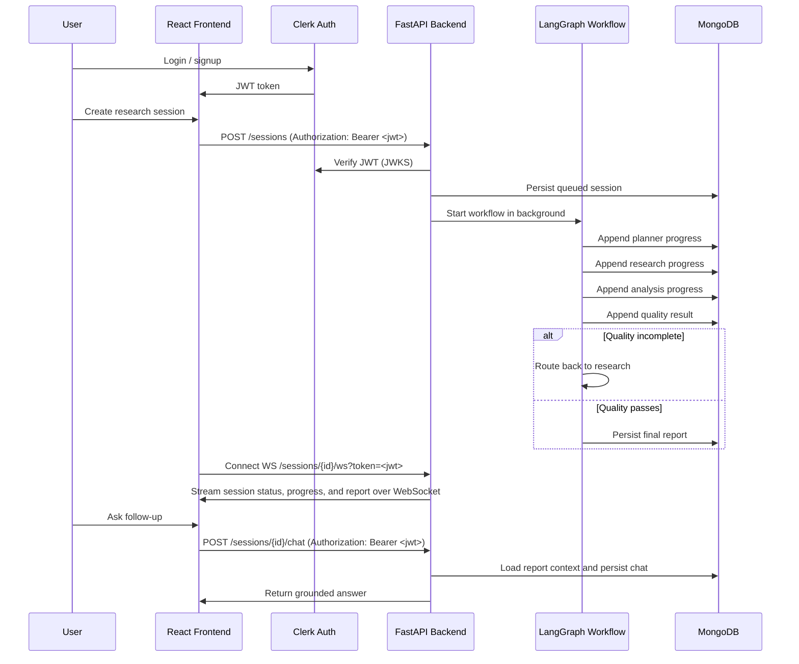

# Architecture

## System Flow

## Components

### Frontend

React handles the operational workflow:

- Session creation form
- Session history
- Session detail view
- Workflow progress visualization
- Structured report renderer
- Follow-up chat panel with a dedicated scrollable message area and separate composer
- Loading and error states

### Auth

Clerk handles identity. The frontend obtains a short-lived JWT after login. Every API request attaches it as `Authorization: Bearer <token>`. The backend verifies the JWT against Clerk's JWKS endpoint and extracts the user ID (`sub`) for session isolation. WebSocket connections pass the token as a `?token=` query parameter since browser WebSocket cannot send custom headers.

### Backend

FastAPI owns the application boundary:

- Verifies Clerk JWTs on every protected endpoint
- Validates session and chat requests
- Starts workflow execution in the background
- Exposes session state through REST endpoints and a WebSocket stream
- Handles chat requests against report context
- Centralizes CORS, configuration, and error handling

### LangGraph

The workflow is implemented as a stateful graph:

1. `planner`: creates the research plan.
2. `research`: fetches public website context.
3. `analysis`: synthesizes account insights.
4. `quality_check`: scores completeness.
5. Conditional route: retry research if the report is incomplete.
6. `report_generation`: writes the structured briefing.

The graph uses shared state for company details, objective, raw research, analysis, quality score, retries, errors, and the final report.

### Persistence

MongoDB persists:

- Session metadata
- Workflow status
- Intermediate progress events
- Final report
- Errors
- Chat transcript

MongoDB was chosen for flexible document storage — session progress and report sections are nested JSON that maps naturally to documents without schema migrations. In production this scales horizontally with replica sets.

### Realtime Updates

The backend exposes `WS /sessions/{session_id}/ws` as a WebSocket endpoint. The frontend connects when a session becomes active, receives full session snapshots as JSON messages, and refreshes progress, report, and chat state in real time. The JWT is passed as a `?token=` query parameter on the WebSocket URL because the browser WebSocket API does not support custom headers.

## Data Model

`sessions`

- `id`
- `company_name`
- `website`
- `objective`
- `status`
- `progress`
- `report`
- `errors`
- `chat`
- `created_at`
- `updated_at`

JSON fields are stored as text for assignment simplicity.

## Failure Handling

- Website fetch failures are recorded in the graph state and session errors.
- The workflow is designed to generate a report with explicit unknowns when research context is limited, but the no-key analysis fallback should be wired and verified before offline report generation is considered supported.
- Fatal workflow exceptions mark the session as `failed`.
- The quality node provides recoverability by routing incomplete work back to research before final report generation, with retry limits enforced in graph state.

## Production Upgrade Path

- Move background execution to a queue worker such as Celery, RQ, or Dramatiq.
- Add live search and enrichment providers.
- Add WebSocket reconnect logic and durable message delivery for long-running workflows.
- Add tenant isolation and per-user quotas on top of existing Clerk auth.
- Add LangGraph checkpointing with durable storage.
- Use LangSmith for workflow tracing connected to Grafana and Loki for observability.
